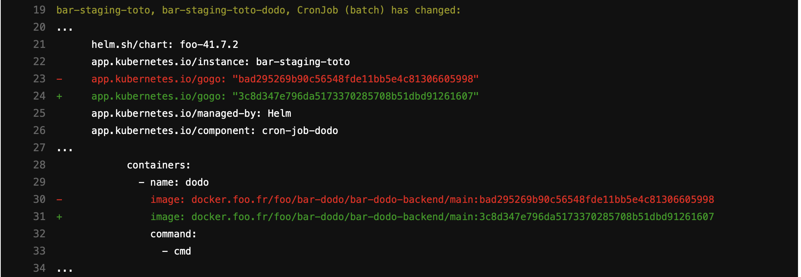
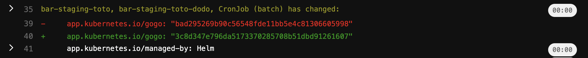
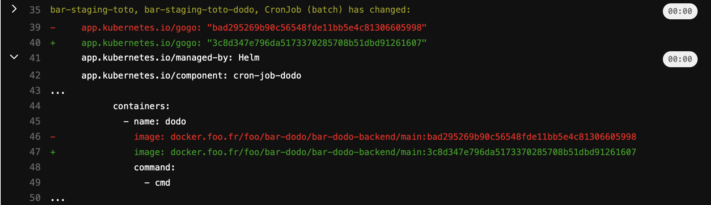

# cicdbox
`CI/CD` magic (or hacks) without spaghetti shell code on your end.

Intendend for `Gitlab CI/CD` (for now), and hosted here (for now) for accessibility reasons. You can find a Gitlab mirror [here](TBD).

## Available tools

### collapse-helm-diff

No one would check a 2000 lines diff, no one would even browse them!

This tool makes `helm diff` more readable by collapsing diff lines which provide no real information, they could be: docker images's tags relying on the git sha, checksums etc.

It takes advantage of Gitlab [collapsed job log sections](https://docs.gitlab.com/ee/ci/jobs/#pre-collapse-sections).

Example:

Diff without `collapse-helm-diff`:



After hiding `image: docker.foo.fr...` diffs:

```
  - helm diff | ./cicdbox collapse-helm-diff '^\s+-?image: docker\.foo\.fr' 
```

The diff will look like:



One can then expand sections if needed:




This works well with `--context` set to `1` for `helm diff`.

`./cicdbox collapse-helm-diff regex1 regex2 ...` (Regexes to match diffs to hide, RE2 syntax as described [here](https://github.com/google/re2/wiki/Syntax))

Supposes `echo` is available.

### annotate-helmfile-releases

Adds `GITLAB_USER_LOGIN` and `CI_PIPELINE_URL` as annotations to the `sh.helm.release.v1.RELEASE.vN` secrets corresponding to releases you sync with `helmfile`.

Example:

```
  - helmfile --selector foo=bar sync
  - ./cicdbox annotate-helmfile-releases --selector foo=bar
```

will add `cicdbox/*` annotations like:

```
kind: Secret
apiVersion: v1
metadata:
  name: sh.helm.release.v1.SELECTED-RELEASE.v1
  ...
  annotations:
    cicdbox/releaser: $GITLAB_USER_LOGIN
    cicdbox/gitlab-ci-pipeline-url: $CI_PIPELINE_URL
...
```

This can help understanding how a release ended up there, how to fix it, whom to blame :) etc. (one can expose these metadata as Prometheus metrics and create alerts about old/abndonned releases.)

`./cicdbox annotate-helmfile-releases --help` for more details.

Supposes `helmfile` and `kubectl` are available.
